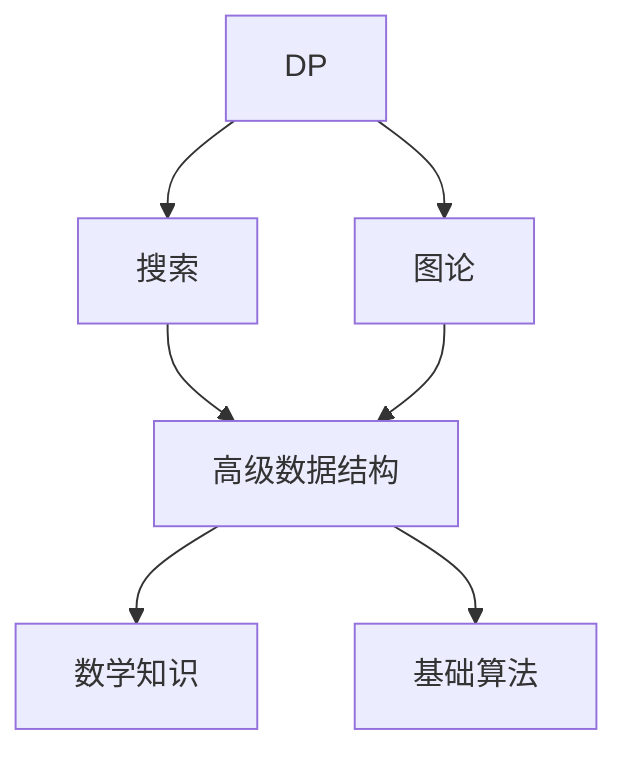

# 算法进阶――基于《算法进阶指南》

---

[AcWing](http://www.acwing.com/)
[洛谷](https://www.luogu.com.cn/)

## 学习流程

## 学习任务安排（暂定）
对于DP和搜索：复习 + 做题
对于其他：学习 + 课后题 + 定期复习 + 做题

- 学习：学习 **AcWing** 算法进阶课内容
- 课后题：做 **AcWing** 对应课后习题
- 复习：回顾笔记，并**重做**课后题
- 做题：刷洛谷题单，每天至少保持两题的题目量

## 学习目标
蓝桥杯国奖