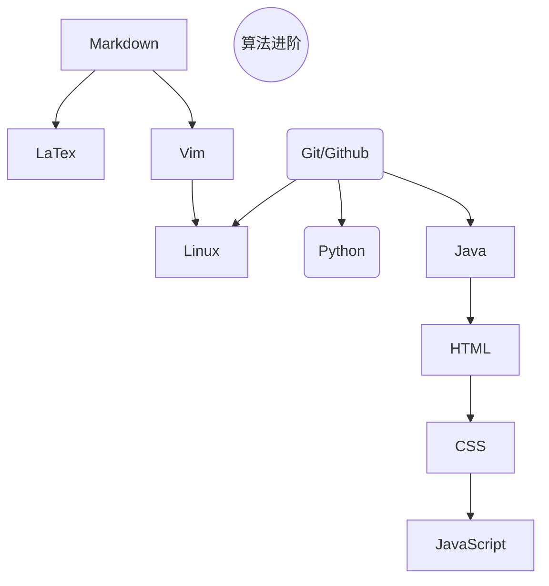

# 自学笔记
> 说明：由于大一对大学的认识不足，遂于大二开始进行自学，接下来我将对从大二开始的自学之路进行安排

## 大二上
### 核心任务
- [ ] markdown：熟悉markdown基本语法，并应用于日常的**笔记**书写
- [ ] Vim：熟练使用Vim进行文本编辑，并逐渐替代word等成为主流**文本编辑器**
- [ ] Linux：熟悉Linux常见指令以及使用方法，逐步将**开发工作**转移到Linux上
- [ ] Python：熟练使用python进行**数学建模**代码的编写
- [ ] 算法进阶：学习算法进阶课，熟悉常见的算法流程，备赛**蓝桥杯国赛**
- [ ] Git/Github：熟悉使用Git/Github来管理自己的代码
- [ ] LaTex：熟练使用LaTex代替word进行**论文**的书写
- [ ] Java：熟练使用Java进行项目开发

### 流程

### 学习参考
[CS自学指南](https://csdiy.wiki/)
[菜鸟教程](http://www.runoob.com/)

#### 算法进阶
[AcWing](http://www.acwing.com/)
[洛谷](https://www.luogu.com.cn/)

#### Vim
[中文版教程](https://wsdjeg.net/vim-galore-zh-cn/)

#### Git
[视频教程](https://www.bilibili.com/video/BV1vy4y1s7k6/?vd_source=5b8f11e7177b71b6595f8aece955601f)
[文字教程](https://git-scm.com/book/zh/v2)
[交互式教程](https://learngitbranching.js.org/?locale=zh_CN)
[拓展](https://cbea.ms/git-commit/)

#### Github
[官方教程](https://docs.github.com/zh/get-started)
[项目推荐](https://hellogithub.com/)

#### LaTex
[安装](https://github.com/OsbertWang/install-latex-guide-zh-cn)
[教程](https://mirrors.bfsu.edu.cn/CTAN/info/lshort/chinese/lshort-zh-cn.pdf)
[练习](https://www.overleaf.com/)

#### Python
[基础教程](https://www.codecademy.cn/tutorial/python/)

[回到顶部](#自学笔记)

### Java
[基础教程](https://how2j.cn/)